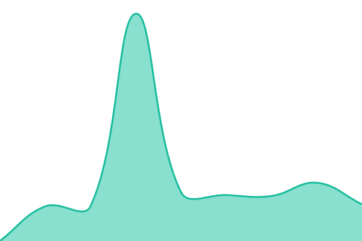
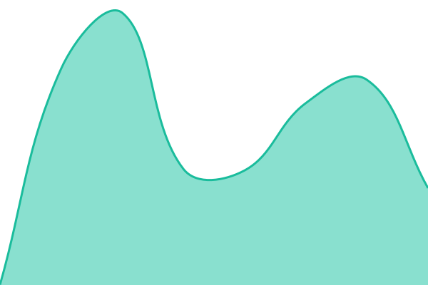
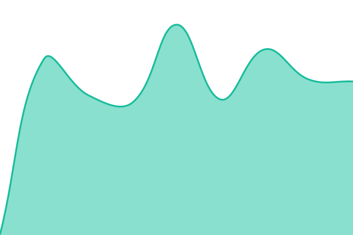

# [📈 Live Status](https://nguyenhx2.github.io/tvj-upptime): <!--live status--> **🟩 All systems operational**

This repository contains the open-source uptime monitor and status page for [Brian](https://www.engineeringjournal.dev/), powered by [Upptime](https://github.com/upptime/upptime).

With [Upptime](https://upptime.js.org), you can get your own unlimited and free uptime monitor and status page, powered entirely by a GitHub repository. We use [Issues](https://github.com/nguyenhx2/tvj-upptime/issues) as incident reports, [Actions](https://github.com/nguyenhx2/tvj-upptime/actions) as uptime monitors, and [Pages](https://nguyenhx2.github.io/tvj-upptime) for the status page.

<!--start: status pages-->
<!-- This summary is generated by Upptime (https://github.com/upptime/upptime) -->
<!-- Do not edit this manually, your changes will be overwritten -->
<!-- prettier-ignore -->
| URL | Status | History | Response Time | Uptime |
| --- | ------ | ------- | ------------- | ------ |
|  [Status page](https://status.tvj.services) | 🟩 Up | [status-page.yml](https://github.com/nguyenhx2/tvj-upptime/commits/HEAD/history/status-page.yml) | 

 528ms
     
 | 

<a href="https://nguyenhx2.github.io/tvj-upptime/history/status-page">100.00%</a>
    

|  [CodeLens landing](https://codelens.tvj.jp/solution) | 🟩 Up | [code-lens-landing.yml](https://github.com/nguyenhx2/tvj-upptime/commits/HEAD/history/code-lens-landing.yml) | 

 782ms
     
 | 

<a href="https://nguyenhx2.github.io/tvj-upptime/history/code-lens-landing">100.00%</a>
    

|  [NexusIQ landing](https://nexusiq.tvj.services) | 🟩 Up | [nexus-iq-landing.yml](https://github.com/nguyenhx2/tvj-upptime/commits/HEAD/history/nexus-iq-landing.yml) | 

 647ms
     
 | 

<a href="https://nguyenhx2.github.io/tvj-upptime/history/nexus-iq-landing">100.00%</a>
    

|  [CloudVise landing](https://cloudvise.tvj.services) | 🟩 Up | [cloud-vise-landing.yml](https://github.com/nguyenhx2/tvj-upptime/commits/HEAD/history/cloud-vise-landing.yml) | 

 459ms
     
 | 

<a href="https://nguyenhx2.github.io/tvj-upptime/history/cloud-vise-landing">100.00%</a>
    

|  [Namecard Creator](https://meishi.tvj.services) | 🟩 Up | [namecard-creator.yml](https://github.com/nguyenhx2/tvj-upptime/commits/HEAD/history/namecard-creator.yml) | 

 271ms
     
 | 

<a href="https://nguyenhx2.github.io/tvj-upptime/history/namecard-creator">100.00%</a>
    

|  [koe composer](https://koe.tvj.services/admin) | 🟩 Up | [koe-composer.yml](https://github.com/nguyenhx2/tvj-upptime/commits/HEAD/history/koe-composer.yml) | 

 216ms
     
 | 

<a href="https://nguyenhx2.github.io/tvj-upptime/history/koe-composer">100.00%</a>
    

<!--end: status pages-->

[**Visit our status website →**](https://nguyenhx2.github.io/tvj-upptime)

## 📄 License

- Powered by: [Upptime](https://github.com/upptime/upptime)
- Code: [MIT](./LICENSE) © [Anand Chowdhary](https://anandchowdhary.com)
- Data in the `./history` directory: [Open Database License](https://opendatacommons.org/licenses/odbl/1-0/)
